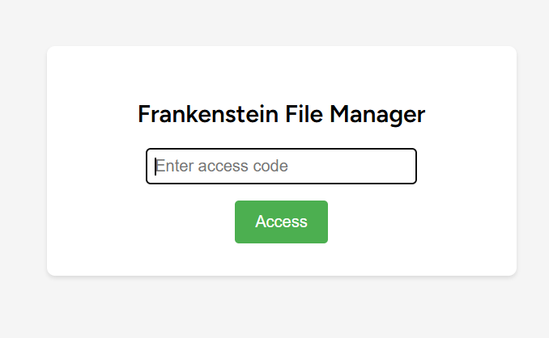
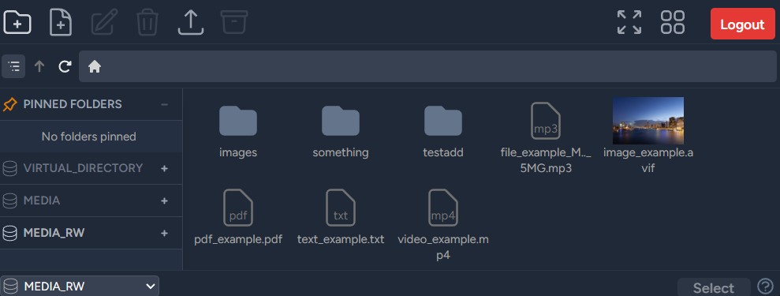

## Vuefinder File Manager

### About

A file manager built from Frankenstein monster's fusion of [Vuefinder](https://github.com/n1crack/vuefinder) and [vuefinder-wsgi](https://github.com/abichinger/vuefinder-wsgi).

### Preview

### Directory Binding

Configure directories to be bound in [config.toml](/backend/config.toml)

### REST API

[Documentation](README.api.md)

### Credits

[@n1crack](https://github.com/n1crack)
[@abichinger](https://github.com/abichinger)

### License

Copyright (c) 2018 Yusuf ÖZDEMİR, released under [the MIT license](LICENSE)
